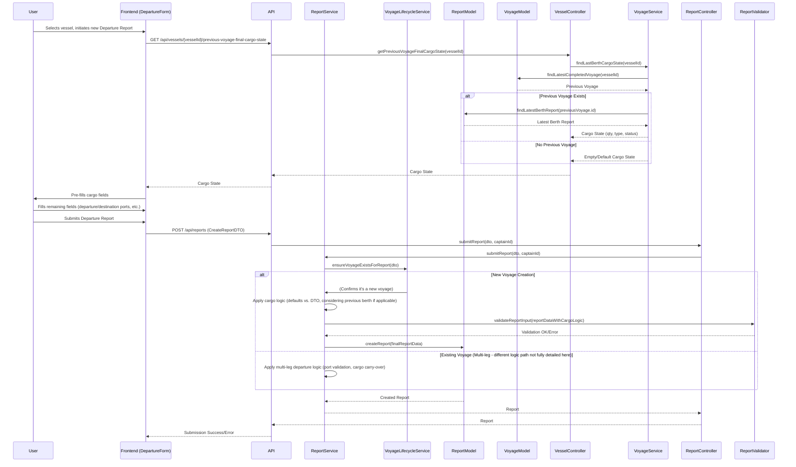

# Plan: Departure Report Logic Enhancements

**I. Introduction**

The recent attempt to submit a departure report failed due to a cargo quantity exceeding the vessel's deadweight (`Cargo quantity (75000 MT) exceeds vessel deadweight (32117 MT)`). This incident has brought to light several key business rules regarding how departure reports, especially subsequent ones or those starting new voyages, should handle data like cargo state and departure/destination ports. This plan outlines the necessary modifications to the backend services and frontend forms to implement this logic correctly.

**II. Core Issues & Proposed Solutions Overview**

1.  **Incorrect Cargo Quantity:** The immediate issue was submitting a cargo quantity (75,000 MT) far exceeding the vessel's deadweight (32,117 MT). For future submissions, a realistic quantity (e.g., ~32,000 MT, as per user suggestion based on the last berth report) should be used.
2.  **Logic for New Voyages (First Departure):**
    *   **Cargo State:** The `cargoQuantity`, `cargoType`, and `cargoStatus` for the first departure report of a *new* voyage should be determined based on the vessel's state at the end of its *previous* voyage (specifically, from the latest `BerthReport`).
    *   **Departure Port:** Manually entered by the user.
3.  **Logic for Subsequent Departures within an Existing Voyage (Multi-Leg Voyages):**
    *   **Departure Port:** Should be pre-filled from the `destinationPort` of the *previous departure report* within the same voyage, or the `arrivalPort` if the previous leg ended with an arrival report.
    *   **Cargo State:** Should be carried over from the state recorded in the *latest report* of the current active voyage.

**III. Detailed Implementation Plan**

**A. Backend Modifications**

**Goal 1: Enhance `ReportService` and `VoyageLifecycleService` for intelligent data handling in `submitReport`.**

*   **Task 1.1: Logic for First Departure of a *New* Voyage**
    *   Location: [`src/services/report.service.ts`](src/services/report.service.ts) (within `submitReport`) and potentially [`src/services/voyage_lifecycle.service.ts`](src/services/voyage_lifecycle.service.ts).
    *   When a `departure` report is submitted and it triggers the creation of a *new voyage*:
        1.  Fetch the latest `Voyage` for the `vesselId`.
        2.  If a previous voyage exists, fetch its latest `BerthReport` ([`src/models/report.model.ts`](src/models/report.model.ts)).
        3.  Based on this `BerthReport`:
            *   If `cargoUnloaded` was the significant operation or the vessel was empty: The new departure's `cargoStatus` defaults to 'Empty', `cargoQuantity` to 0.
            *   If `cargoLoaded` was the significant operation: The new departure's `cargoStatus` defaults to 'Loaded', `cargoQuantity` to the amount on board after loading (this might be `berthReport.cargoLoaded` or a calculated total on board if available), and `cargoType` should match.
            *   If the user *provides* `cargoQuantity`, `cargoType`, `cargoStatus` in the DTO, these values could override the defaults, but *must still pass validation* (e.g., against deadweight via [`src/services/report_validator.ts`](src/services/report_validator.ts:42)). The primary goal here is intelligent defaulting if these fields are *not* provided or if we want to enforce continuity.
        4.  The `initialRob*` fields from the DTO will be used to set the initial ROBs for this new voyage.

*   **Task 1.2: Logic for Subsequent Departure within an *Existing* Voyage (Multi-Leg)**
    *   Location: [`src/services/report.service.ts`](src/services/report.service.ts) (within `submitReport`).
    *   When a `departure` report is submitted for an *existing active voyage* and it's *not* the first departure for that voyage:
        1.  Fetch the latest report of any type for the current active voyage.
        2.  **Departure Port Validation:**
            *   Let `previousLegDestination` be the `destinationPort` of the latest `DepartureReport` in the current voyage, or `arrivalPort` of the latest `ArrivalReport` in the current voyage.
            *   Validate that the submitted `departurePort` matches `previousLegDestination`. If not, throw a validation error.
        3.  **Cargo State Continuity:**
            *   The submitted `cargoQuantity`, `cargoType`, and `cargoStatus` should ideally match the state from the latest report of the active voyage. The system could either:
                *   **Validate:** Ensure the submitted cargo details are consistent with the last known state.
                *   **Override/Default:** Ignore submitted cargo details for a mid-voyage departure and forcibly carry them over from the latest report of the active voyage. This seems more robust for data integrity within a voyage.
        4.  `initialRob*` fields are ignored for mid-voyage departures.

**B. Frontend Modifications**

**Goal 2: Enhance `DepartureForm` for intelligent pre-filling.**

*   **Task 2.1: Pre-filling for a *New* Voyage**
    *   Location: [`frontend/src/components/forms/DepartureForm.tsx`](frontend/src/components/forms/DepartureForm.tsx).
    *   When the form is loaded to create a new voyage for a selected vessel:
        1.  **API Call:** Implement a new API endpoint (e.g., `GET /api/vessels/:vesselId/previous-voyage-final-cargo-state`) that returns the `cargoQuantity`, `cargoType`, and `cargoStatus` from the latest berth report of the vessel's last completed voyage.
            *   This requires a new backend controller method and service logic.
        2.  **Pre-fill Form:** Use the fetched data to pre-fill `cargoQuantity`, `cargoType`, and `cargoStatus` fields.
        3.  `departurePort` and `destinationPort` remain manual entry.

*   **Task 2.2: Pre-filling for a Subsequent Departure within an *Existing* Voyage (Multi-Leg)**
    *   Location: [`frontend/src/components/forms/DepartureForm.tsx`](frontend/src/components/forms/DepartureForm.tsx).
    *   When the form is loaded in the context of an existing active voyage (UI/UX for this flow needs to be considered):
        1.  **API Call:** Fetch the latest report (or specifically latest `DepartureReport` or `ArrivalReport`) for the active voyage.
        2.  **Pre-fill Form:**
            *   `departurePort`: Pre-fill with `destinationPort` of the latest `DepartureReport` or `arrivalPort` of the latest `ArrivalReport`. Make this field read-only or clearly indicate it's pre-filled for continuity.
            *   `cargoQuantity`, `cargoType`, `cargoStatus`: Pre-fill from the cargo details of that latest report. These fields might also be read-only or have restricted editing to maintain voyage data integrity.
            *   `destinationPort` remains manual entry for the new leg.

**IV. Data Flow Diagram (Mermaid)**

This diagram illustrates the logic for determining cargo state when a **new voyage** is initiated via a Departure Report:



**V. Clarification Point**

*   **Multi-Leg Voyage UI/UX:** How does a captain initiate a "subsequent departure report within the same voyage"? Is there a specific UI flow for this, or is the system expected to detect this context automatically when a departure report is submitted for a vessel with an already active voyage? Understanding this will help refine the frontend pre-filling logic for this scenario.

**VI. Next Steps**

1.  **Review and Approve Plan:** (This step is complete)
2.  **Corrected Sample Payload (for immediate testing if needed):**
    Based on the deadweight of 32117 MT and user suggestion of ~32000 MT from the last berth report, a corrected `cargoQuantity` in the sample payload would be:
    ```json
{
    "cargoQuantity": 32000,
    "cargoType": "Crude Oil",
    "cargoStatus": "Loaded"
}
    ```
3.  **Write to Markdown:** (This step)
4.  **Switch to Implementation Mode:** After approval, request to switch to "Code" mode to begin implementing these changes with a developer.